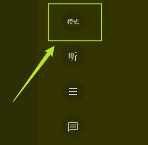

<h2>Wechat Read Mode</h2>

网页版微信读书护眼配色多种模式选择，现已集成10种不同的颜色模式来供于你的阅读！

 

## 安装
### 先决条件
在使用之前请确保您的浏览器已经安装 [tampermonkey](https://www.tampermonkey.net/) 插件，若还没有安装则可以通过以下链接进行安装：

- Chrome：[tampermonkey](https://chrome.google.com/webstore/detail/tampermonkey/dhdgffkkebhmkfjojejmpbldmpobfkfo)
- Edge：[tampermonkey](https://microsoftedge.microsoft.com/addons/detail/tampermonkey/iikmkjmpaadaobahmlepeloendndfphd)
- 国内源：
    - 360：[tampermonkey](https://ext.chrome.360.cn/webstore/search/tampermonkey)
    - 收藏猫：[tampermonkey](https://chrome.pictureknow.com/extension?id=4d999497b75d4eb6acf4d0db3053f1af)
    - gugeapps: [tampermonkey](https://www.gugeapps.net/webstore/detail/tampermonkey/dhdgffkkebhmkfjojejmpbldmpobfkfo)

### 脚本安装
进入 [Greasyfork](https://greasyfork.org/zh-CN/scripts/446123-%E5%BE%AE%E4%BF%A1%E8%AF%BB%E4%B9%A6%E6%8A%A4%E7%9C%BC%E9%85%8D%E8%89%B2%E5%A4%9A%E7%A7%8D%E6%A8%A1%E5%BC%8F%E9%80%89%E6%8B%A9) 的脚本详情页，点击`安装此脚本`即可进行安装到你的`Tampermonkey`

## 使用
进入[微信读书网页版](https://r.qq.com)，登录之后点击任意一本读物进入到阅读页面，阅读页的右侧工具栏会最顶端会出现一个`模式`的按钮：

点击`模式`按钮即可更换配色模式，点击一次更换一种配色，并且会将您的选择持久化到您的浏览器本地存储中，下次进来会自动加载您选中的配色。

## 反馈
若您在使用过程中有任何问题/建议可以到 [issue](https://github.com/Licoy/wechat-read-mode/issues/new) 中提出。

## 开源协议
[MIT](https://github.com/Licoy/wechat-read-mode/blob/main/LICENSE)